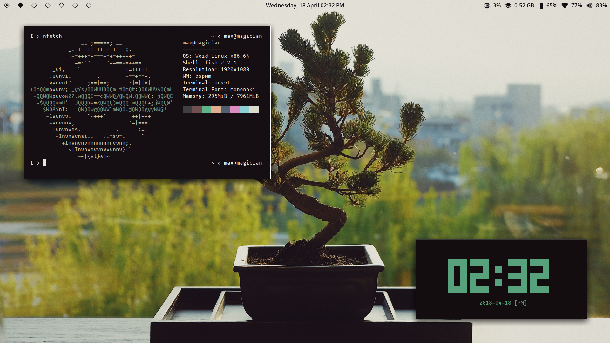

# Max's Dotfiles 💾



These are my dotfiles. They are customizable and can be deployed on different devices, thanks to their modular nature and the use of templating.

Also check out [ricecooker](https://github.com/maxadamski/ricecooker), my project I used to make these.

# Software

My main operating system is Void Linux.

Some of the programs I use:

```
- shell:          fish
- text editor:    neovim
- file manager:   ranger
- terminal:       kitty
- window manager: bspwm
- status bar:     polybar
- launcher:       rofi
- notifications:  dunst
- compositor:     compton
- image viewer:   sxiv
- video player:   mpv
- music player:   ncmpcpp
- web browser:    firefox (migrating to luakit)
- mail client:    thunderbird (migrating to mutt?)
- office: sc-im, calc, latex+beamer, libreoffice
```

# Installation

```sh
git clone https://github.com/maxadamski/dotfiles ~/.dotfiles
cd ~/.dotfiles
./rice bootstrap
```

# Credits

Special thanks to the creators of the wonderful software.

Some scripts in `bin` are taken from around the internet. Big thanks to the people who wrote them too!
